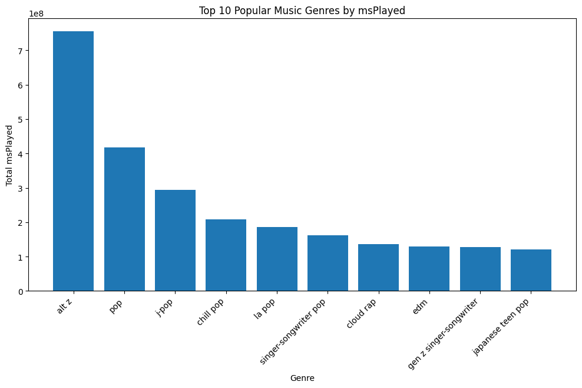

# Spotify Data Analysis 2022

## Introduction

This repository contains an analysis of Spotify song features using the "Spotify Song Attributes" dataset. The dataset includes diverse information such as genre, energy, loudness, speechiness, duration, tempo, etc.

## Dataset

## Analysis Overview

1. **Data Cleaning:**
   - Duplicate data has been removed from the dataset.
   - Missing values in the 'genre' column have been filled.

2. **Top 10 Genres:**
   - A bar chart illustrating the total playtime (`msPlayed`) in the top 10 music genres.

 

3. **Top 10 Artists:**
   - A bar chart showing the total playtime (`msPlayed`) for the top 10 artists.

  

4. **Top Artist Analysis: RADWIMPS**
   - A bar chart illustrating the total playtime (`msPlayed`) for the top artist RADWIMPS.

   RADWIMPS stands out as the top artist among others in the dataset. Their songs have been individually analyzed, and below is a list of the top 10 tracks by playtime.

5. **Numerical Features Histogram:**
   - Histograms of numerical features to gain insights into their distribution.

6. **Average Song Features by Genre:**
   - A radar chart illustrating the average energy, loudness, speechiness, duration, tempo, and liveness for different music genres.

## Conclusion

In conclusion, this analysis provides important insights into the distribution of song features, popular genres, artists, and specific songs. Please review the images and data for a deeper understanding of the characteristics of your Spotify data.

## Dependencies

- pandas
- matplotlib
- numpy

Install the required dependencies by running the command `pip install -r requirements.txt`.

Feel free to start exploring your Spotify dataset with this analysis or make additions as needed!
